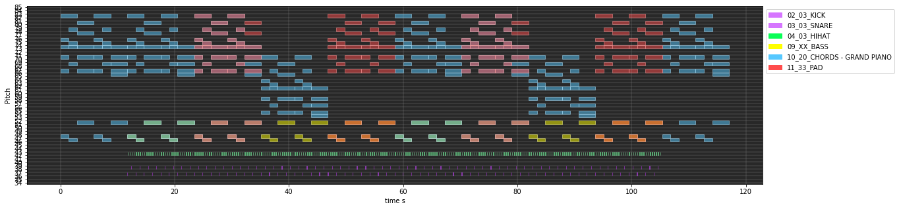
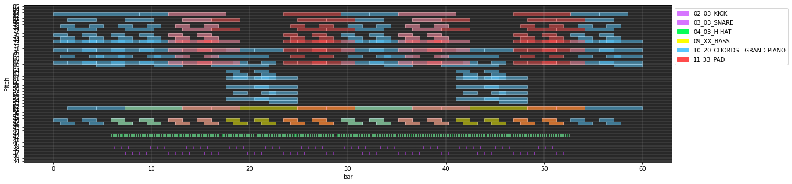
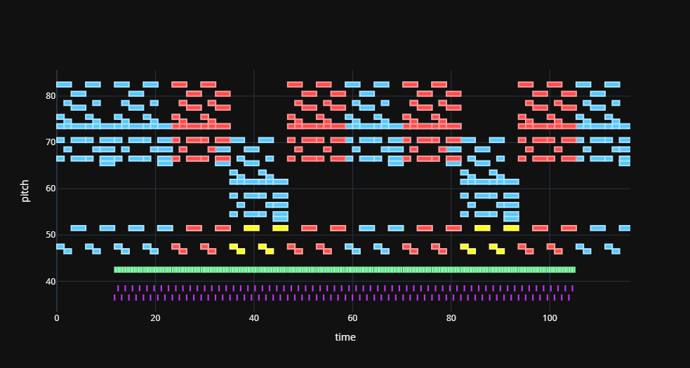

A python library for MIDI plotting and handling tools.

beta.0 (June 2021) version

## Documentation

See documentation [here](https://carlosholivan.github.io/midiplot)

## Features

### 1. MIDI processing with pretty_midi library.

```python
from midiplot import midiprocessing

midi_infile = 'path/to/midi_file.mid'
midi = midiprocessing.MidiProcessing(midi_infile)

all_tracks = midi.get_tracks()
m_gt.print_tracks()
```

```
Track no: 0 | Program no: 0 | Track name: 02_03_KICK | is drum: False
Track no: 1 | Program no: 0 | Track name: 03_03_SNARE | is drum: False
Track no: 2 | Program no: 0 | Track name: 04_03_HIHAT | is drum: False
Track no: 3 | Program no: 0 | Track name: 09_XX_BASS | is drum: False
Track no: 4 | Program no: 0 | Track name: 10_20_CHORDS - GRAND PIANO | is drum: False
Track no: 5 | Program no: 0 | Track name: 11_33_PAD | is drum: False
```

### 2. Pianoroll representations of:

* Single tracks 

```python
track = m_gt.get_singletrack_by_name("09_XX_BASS")

plots = midiprocessing.Pianoroll()
track = midi.get_singletrack_by_name("09_XX_BASS")
plots.plot_singletrack_pianoroll(track, axis='time'         plot_title="Track n. {}".format(track["n_track"]))
    
plots.plot_all_tracks(all_tracks, axis='bar')
```


* Multitracks in one or different subplots.

```python
all_tracks = midi.get_tracks()
plots.plot_all_tracks(all_tracks, axis='time')
```




* Time axis can be also represented in ``bars``

```python
all_tracks = midi.get_tracks()
plots.plot_all_tracks(all_tracks, axis='bar')
```



* HTML plots with ``plotly`` module

```python
plots.plot_all_tracks_html(all_tracks)
```



## Dependencies

* [Numpy](https://numpy.org/)
* [Matplotlib](https://matplotlib.org/)
* [pretty_midi](https://github.com/craffel/pretty-midi)
* [plotly](https://plotly.com/)

## Installation

Pip package:
```
pip install midiplot
```

From source:
```
cd .path/to/timbre-vae
python setup.py install
```


## License

This software is for research purposes. For comercial purposes, please contact the author: carloshero@unizar.es

If you use this software you must include the link to this repository: https://github.com/carlosholivan/midiplot


## Authors

[**Carlos Hernández**](https://carlosholivan.github.io/index.html) - carloshero@unizar.es

Department of Electronic Engineering and Communications, Universidad de Zaragoza, Calle María de Luna 3, 50018 Zaragoza
